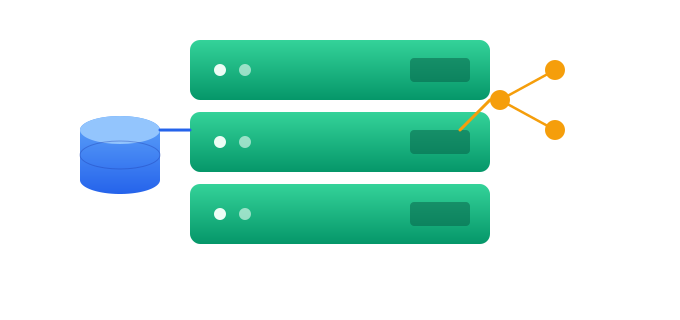

<div align="center">
  

  


</div>

## About

This repository documents a structured, concept-by-concept approach to learning JavaScript backend development from the ground up. Each topic from the **Chai aur Code** series is practiced in its own dedicated file - no combined scripts, no skipped concepts.

Alongside the notes, this repo now also holds the **actual Backend + Frontend fullstack project** (`Chai-Backend/Backend` and `Chai-Backend/Frontend`) built while following the deployment and fullstack modules - not just theory, but a real Express + Vite app wired together and deployed.

> The goal is not just to watch and move on. Every session produces a committed file or a working piece of code. The commit history is the learning log. <br/>
> ⚠️ **Note:** The `Structure`, `Topics Roadmap`, and `Mega Project` sections below are living/WIP - they'll keep changing as the playlist progresses and new folders/files get added. Treat them as a snapshot, not a fixed blueprint.
---

## Structure 🔄 *(subject to change)*

```
Backend-Journey/
│
├── 📁 .obsidian/                          # Obsidian vault config (notes are viewed/edited here)
│
├── 📁 Chai-Backend/
│   │
│   ├── 📁 Backend/                        # actual Express server
│   │   ├── package.json
│   │   ├── package-lock.json
│   │   └── server.js
│   │
│   ├── 📁 Frontend/                       # actual Vite + React client
│   │   ├── dist/                          # production build output
│   │   ├── public/
│   │   ├── src/
│   │   ├── .gitignore
│   │   ├── eslint.config.js
│   │   ├── index.html
│   │   ├── package.json
│   │   ├── package-lock.json
│   │   ├── vite.config.js
│   │   └── README.md
│   │
│   ├── 📁 Playlist-Notes/                 # video-by-video concept notes + code
│   │   ├── 📁 03_Data-Modelling-Mongoose/
│   │   │   ├── Models/
│   │   │   │   ├── e-commerce/
│   │   │   │   ├── hospital-management/
│   │   │   │   └── todos/
│   │   │   └── 03_Data-Modelling-Mongoose.md
│   │   ├── 01_Backend_to_Production.md
│   │   └── 02_Full-Stack-Deployment-Practice.md
│   │
│   └── 📁 Playlist-Tracking/              # live mini-project built while following along
│       ├── node_modules/
│       └── .env
├── 📁 Mega-Project/                       # youtube-style backend - full project (Hitesh sir's chai-backend series)
│   ├── package.json
│   └── README.md                         
|  
├── 📁 Roadmap/
│    ├── 00-START-HERE.md                # quick start guide - where to begin
│    ├── Overview.md                     # complete course outline
│    ├── 1-Introduction.md               # what is backend, client-server, HTTP basics
│    ├── 2-Foundation.md                 # Node.js, npm, package.json, modules
│    ├── 3-ExpressJS.md                  # Express setup, routing, middleware
│    ├── 4-Databases.md                  # MongoDB, PostgreSQL, when to use what
│    ├── 5-ORM-ODM.md                    # Mongoose, Sequelize, schema, models
│    ├── 6-API-Development.md            # REST APIs, CRUD, auth, JWT
│    ├── 7-Deployment.md                 # production, environment, hosting
│    ├── Behind-The-Scenes.md            # how this repo/roadmap itself was structured
│    │
│    ├── 📁 Projects/
│    │   ├── Project-Ideas.md            # project list with difficulty levels
│    │   └── Project-Setup-Template.md   # boilerplate setup for every project
│    │
│    └── 📁 Resources/
│         ├── Commands-Cheatsheet.md      # quick reference - npm, git, node commands
│         ├── Links-and-Documentation.md  # official docs, useful references
│         └── Useful-Libraries.md         # curated npm packages worth knowing
│
├── 📄 .gitignore
├── 📄 LICENSE
└── 📄 README.md
```

---

## Topics Roadmap 🔄 *(subject to change)*

| File | Module | Status |
|------|--------|--------|
| `1-Introduction.md` | **Introduction** - what is backend · client-server · HTTP · request-response cycle | ✅ Complete |
| `2-Foundation.md` | **Foundation** - Node.js · npm · package.json · CommonJS modules · file system | ✅ Complete |
| `3-ExpressJS.md` | **Express.js** - server setup · routing · middleware · error handling · MVC | ✅ Complete |
| `4-Databases.md` | **Databases** - MongoDB · PostgreSQL · SQL vs NoSQL · when to use what | ✅ Complete |
| `5-ORM-ODM.md` | **ORM/ODM** - Mongoose · Sequelize · schemas · models · CRUD | ✅ Complete |
| `6-API-Development.md` | **API Development** - REST principles · CRUD APIs · JWT auth · Postman testing | ✅ Complete |
| `7-Deployment.md` | **Deployment** - environment variables · production setup · hosting | ✅ Complete |
| `Behind-The-Scenes.md` | **Behind The Scenes** - how the roadmap/repo itself is organized and why | ✅ Complete |

> 🔄 Currently tracking: `Playlist-Notes/` - video-by-video notes (Mongoose data modelling in progress: todos, e-commerce, hospital-management)
> 🏗️ Currently building: `Chai-Backend/Backend` + `Chai-Backend/Frontend` - a real fullstack app tying the concepts together
> 🎯 Goal: Production-ready REST APIs - design · build · secure · deploy

---

## 🎬 Mega Project 🔄 *(subject to change)*

Following [`hiteshchoudhary/chai-backend`](https://github.com/hiteshchoudhary/chai-backend) - a complete, production-shaped backend for a YouTube-style video hosting platform.

**Core features:** login/signup · JWT access + refresh tokens · bcrypt password hashing · video upload · like/dislike · comment/reply · subscribe/unsubscribe

This is where every earlier module - Express routing, Mongoose modelling, auth, deployment - comes together into one real app, not isolated exercises.

📐 [ER Diagram](https://app.eraser.io/workspace/YtPqZ1VogxGy1jzIDkzj)

> Tracked under `Mega-Project/` at repo root, alongside `Chai-Backend/`.

## How to Run

**Requirements:** Node.js v18+

```bash
# Clone the repo
git clone https://github.com/AbdurRehmanKhan-ARK/Backend-Journey.git
cd Backend-Journey/Chai-Backend

# Backend
cd Backend
npm install
node server.js
# or with nodemon
npx nodemon server.js

# Frontend (separate terminal)
cd ../Frontend
npm install
npm run dev
```

---

## Series Reference

This repository follows the **JavaScript Backend series by [Chai aur Code](https://www.youtube.com/@chaiaurcode)** on YouTube.
Each file corresponds to a video or concept from the series that is well explained and easy to understand.

---

## Related Repositories

- [JavaScript-Tutorials](https://github.com/AbdurRehmanKhan-ARK/JavaScript-Tutorials) - JS fundamentals to V8 internals · 20 modules · 74 files · 2 weeks
- [Learning-DevOps](https://github.com/AbdurRehmanKhan-ARK/Learning-DevOps) - Docker · Linux · Kubernetes · CI/CD

---

## Feedback & Contributions 🙌

Found a bug in one of the projects? Have a cleaner implementation in mind?
All feedback, corrections, and suggestions are genuinely welcome.

- 🐛 **Bug or mistake** - open an issue
- 💡 **Better approach** - start a discussion
- 🤝 **Want to collaborate** - reach out via email

This is a learning repo, not a perfect one. Every correction makes it better.

---

## Author

**Abdur Rehman Khan** <br>
BS Computer Science · FAST-NUCES Karachi <br>
abdurrehmankhan0909@gmail.com · [GitHub](https://github.com/AbdurRehmanKhan-ARK)

---

<div align="center">

**If this repository helped you understand a concept or saved you time, consider leaving a ⭐ - it genuinely means a lot.**

<br/>

_Built in public. Imperfect by design. Improving every commit._

</div>
