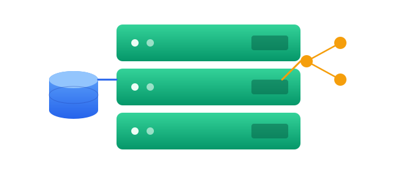

<div align="center">




<br/>


</div>

---

## 📖 About

This repository is my hands-on **Backend Journey** - notes, roadmap files, mini practice projects, and larger backend applications, built while learning Node.js, Express, MongoDB, authentication, and API development step by step.

The philosophy is simple: **learn by building.** Every concept here is practiced inside a real project instead of being left as theory alone.

---

## 📂 What This Repository Contains

- 🗺️ Learning notes and structured topics in the **Roadmap** section
- 🍵 Full-stack practice in the **Chai-Backend** project
- 🎬 A more complete backend project in **Mega-Project**
- 🧪 API testing resources and collections in the **postman** folder
- 📝 Personal notes and learning artifacts in **Mega-Project/docs** and **Playlist-Tracking**
---

## 🗂️ Repository Structure

```text
Backend-Journey/
├── Backend-Journey/
│   └── assets/
├── Chai-Backend/
│   ├── Backend/
│   ├── Frontend/
│   ├── Playlist-Notes/
│   └── Playlist-Tracking/
├── Mega-Project/
├── Roadmap/
├── postman/
├── .obsidian/
├── README.md
└── LICENSE
```

---

## 🎯 Current Focus Areas

- ⚙️ Node.js and Express fundamentals
- 🔌 REST APIs and CRUD operations
- 🧩 Middleware, routing, and error handling
- 🍃 MongoDB and Mongoose models
- 🔐 Authentication and JWT-based flows
- 📤 File upload and deployment basics
- 🔗 Connecting frontend and backend in real projects

---

## 🚀 Projects in This Repo

### 🍵 Chai-Backend

A practical full-stack learning app, connecting the concepts from the learning roadmap to a working application:

- Backend built with **Express**
- Frontend built with **Vite + React**
- Simple API integration between the two layers

### 🎬 Mega-Project

A more complete, backend-focused project inspired by a YouTube-style video hosting platform. Includes:

- 👤 User signup and login
- 🔒 Password hashing with **bcrypt**
- 🔑 JWT-based authentication (access + refresh tokens)
- 🍃 MongoDB models and database interaction
- ☁️ File upload support via Multer + Cloudinary
- 📊 Aggregation pipelines for channel profiles and watch history

---

## ⚡ How to Run

**Requirements:** Node.js 18+

### Chai-Backend - Backend

```bash
cd Chai-Backend/Backend
npm install
npm start
```

### Chai-Backend - Frontend

```bash
cd Chai-Backend/Frontend
npm install
npm run dev
```

### Mega-Project

```bash
cd Mega-Project
npm install
npm run dev
```

---

## 🗺️ Learning Roadmap

The **Roadmap** section contains the main study path for this journey:

| Step | File |
|---|---|
| 00 | [START-HERE](Roadmap/00-START-HERE.md) |
| - | [Overview](Roadmap/Overview.md) |
| 1 | [Introduction](Roadmap/1-Introduction.md) |
| 2 | [Foundation](Roadmap/2-Foundation.md) |
| 3 | [Express.js](Roadmap/3-ExpressJS.md) |
| 4 | [Databases](Roadmap/4-Databases.md) |
| 5 | [ORM / ODM](Roadmap/5-ORM-ODM.md) |
| 6 | [API Development](Roadmap/6-API-Development.md) |
| 7 | [Deployment](Roadmap/7-Deployment.md) |

---

## 📺 Series Reference

This repository follows the JavaScript backend learning path inspired by **Chai aur Code**, and the broader backend development journey from fundamentals to real-world application.

---

## 🤝 Feedback and Contributions

Spotted a mistake, have a better approach, or want to suggest an improvement? Contributions are welcome - this repo is meant to grow as I learn.

---

## 👤 Author

**Abdur Rehman Khan**
BS Computer Science · FAST-NUCES Karachi
📧 abdurrehmankhan0909@gmail.com

---

<div align="center">

⭐ If this repository helped you understand a concept or saved you time, consider leaving a star.

*Built in public. Improving one step at a time.*

</div>
