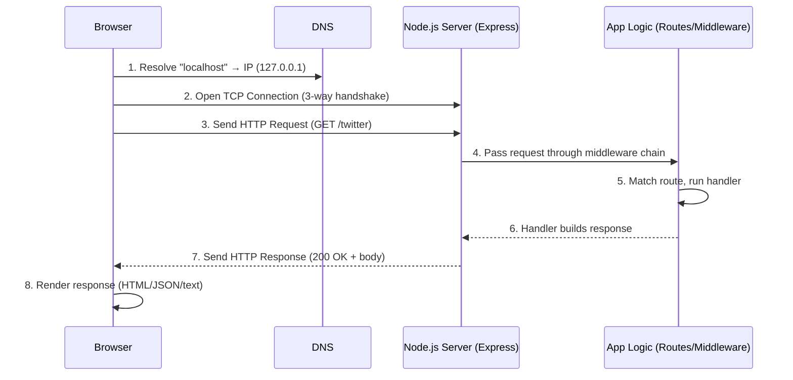
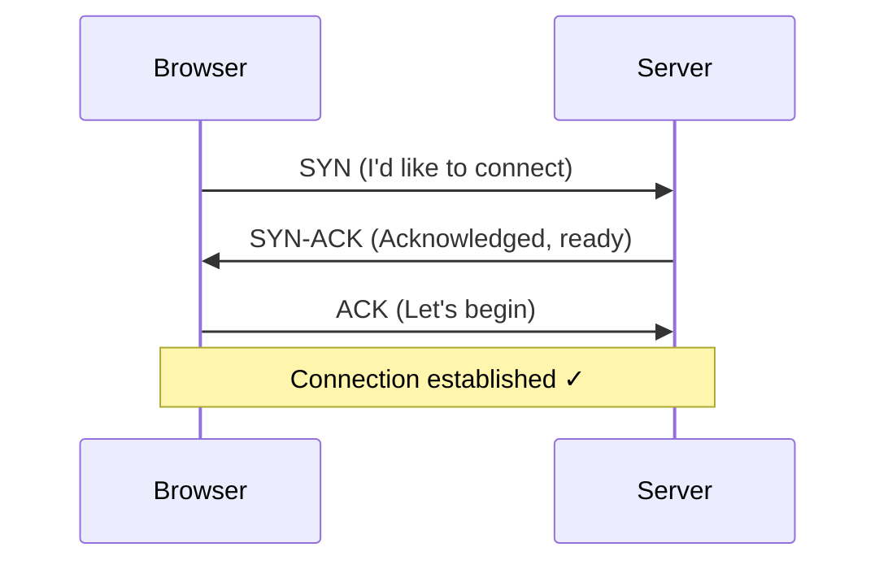
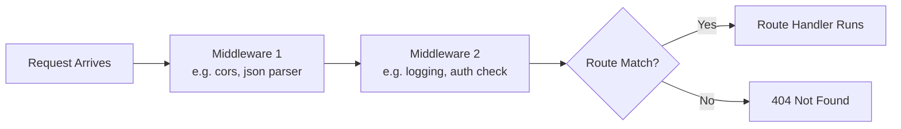
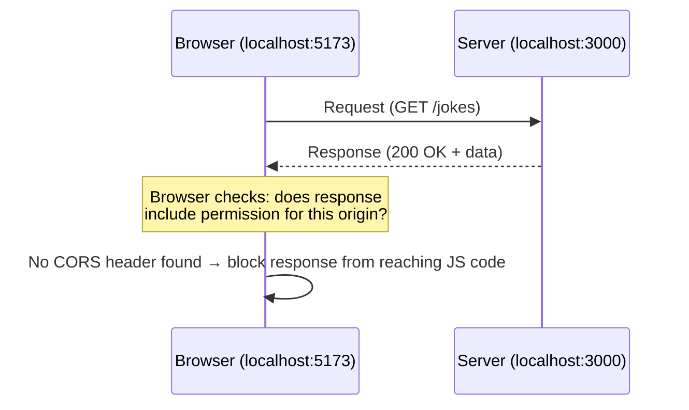
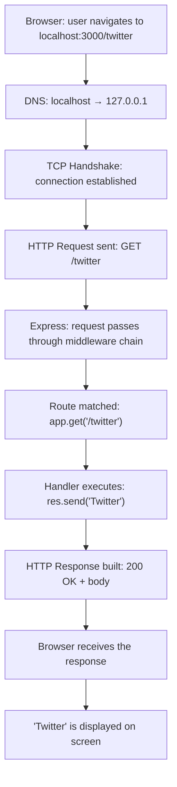

# Behind the Scenes: What Happens When a Request Hits Your Backend

Every time you type `localhost:3000` into a browser or visit any website, a whole chain of events takes place - starting at the network layer and ending deep inside your server code. This document walks through that entire journey step by step, using the `index.js` (Express app) from this repo as a working example.

---

## Quick Overview Diagram



---

## Step 1 - DNS Resolution: Translating a Name into an Address

When you type `localhost:3000` or `google.com`, the browser first needs to figure out **which IP address** that name points to - because computers communicate using numbers (IP addresses), not names.

- `localhost` always resolves to `127.0.0.1` (your own machine) - no internet lookup is needed, so this is instant.
- For real domains (like `google.com`), the browser asks a **DNS server**: "what's the IP for this name?" - similar to looking up a number in a phone book.

**Terminology:**

| Term                     | Meaning                                                                       |
| ------------------------ | ----------------------------------------------------------------------------- |
| DNS (Domain Name System) | The internet's "phone book" - translates domain names into IP addresses       |
| IP Address               | A unique network address for each machine (e.g. `127.0.0.1`, `142.250.65.78`) |
| localhost                | A special name that always refers to your own machine                         |

---

## Step 2 - TCP Connection: Establishing the Link

Once the IP address is known, the browser opens a **TCP connection** to the server - a reliable "pipe" through which data can be safely exchanged.

This happens via a **3-way handshake**:



**Terminology:**

| Term                                | Meaning                                                                                                                                         |
| ----------------------------------- | ----------------------------------------------------------------------------------------------------------------------------------------------- |
| TCP (Transmission Control Protocol) | The protocol that establishes a reliable connection - guarantees data arrives in order and without loss                                         |
| Port                                | A number that identifies **which application** on a machine to talk to (e.g. `3000` - your Express server, `80` - standard HTTP, `443` - HTTPS) |
| Handshake                           | The initial "hello, are you ready?" exchange that sets up a connection                                                                          |

**This is exactly where the `ERR_SSL_PROTOCOL_ERROR` issue occurred earlier** - the browser attempted a TLS handshake on `https://localhost:3000` (an encrypted connection), while the server was only listening on plain HTTP (no encryption configured). The handshake failed as a result. Explicitly using `http://` resolved it, since the browser then attempted a plain connection that matched what the server expected.

---

## Step 3 - HTTP Request: Sending the Actual Message

Once the connection is open, the browser sends an **HTTP Request** - a structured text message that includes:

```
GET /twitter HTTP/1.1
Host: localhost:3000
User-Agent: Chrome/...
Accept: text/html,...
```

**Terminology:**

| Term        | Meaning                                                                                                                 |
| ----------- | ----------------------------------------------------------------------------------------------------------------------- |
| HTTP Method | The action being requested - `GET` (retrieve data), `POST` (submit new data), `PUT`/`PATCH` (update), `DELETE` (remove) |
| Route/Path  | The part of the URL identifying which resource is being requested (e.g. `/twitter`)                                     |
| Headers     | Metadata attached to the request (browser type, accepted formats, cookies, etc.)                                        |
| Body        | The actual payload (usually empty for GET requests, contains form/JSON data for POST)                                   |

In the code, this corresponds to:

```js
app.get("/twitter", (req, res) => { ... });
```

The `req` (request object) already contains all of this information (method, headers, path) in parsed form - Express automatically converts the raw HTTP text into this object.

---

## Step 4 - Server Receives the Request & the Middleware Chain

The request reaches the Node.js process that was started with `node index.js`. Express passes the request through a **middleware chain** before it reaches the matching route handler.



**Terminology:**

| Term          | Meaning                                                                                                                                           |
| ------------- | ------------------------------------------------------------------------------------------------------------------------------------------------- |
| Middleware    | Functions that process a request before it reaches the route handler (e.g. `express.json()` parses the body, `cors()` allows cross-origin access) |
| Route Handler | The function that determines the actual response (`(req, res) => {...}`)                                                                          |
| `req` / `res` | `req` = details of the incoming request, `res` = tools for building the outgoing response                                                         |

The current `index.js` doesn't define any custom middleware yet, but as the app grows (as seen in the NoteForge project with `express.json()` and `cors()`), this layer becomes increasingly important.

---

## CORS: Why the Frontend and Backend Sometimes Can't Talk

CORS (Cross-Origin Resource Sharing) is a browser security rule, not a backend crash. It explains why a request from your React app (`localhost:5173`) to your Express server (`localhost:3000`) can fail even though the server is running perfectly fine.

### What Counts as a Different "Origin"

An origin is the combination of **protocol + domain + port**. If any of these three differ, the browser treats it as a different origin.

| Frontend | Backend | Same Origin? |
|---|---|---|
| `http://localhost:5173` | `http://localhost:3000` | ❌ No (different port) |
| `http://localhost:3000` | `https://localhost:3000` | ❌ No (different protocol) |
| `https://noteforge.com` | `https://api.noteforge.com` | ❌ No (different domain) |
| `http://localhost:5173` | `http://localhost:5173` | ✅ Yes |

### Why the Browser Blocks It

By default, browsers block JavaScript running on one origin from reading responses from a different origin - even if the request itself succeeds on the server. This is a security measure to prevent malicious sites from silently reading data from other sites a user is logged into.



Notice that the server *does* respond - the request isn't rejected at the network level. The browser receives the data, then refuses to hand it to your JavaScript code because the server never explicitly allowed the frontend's origin.

### The Fix: `cors()` Middleware

```js
import cors from "cors";
app.use(cors());
```

This middleware adds a header to every response:

## Access-Control-Allow-Origin: 
This tells the browser "any origin is allowed to read this response," which resolves the block.

**Terminology:**

| Term | Meaning |
|---|---|
| Origin | protocol + domain + port combination |
| CORS | The browser mechanism that restricts cross-origin requests unless explicitly allowed |
| `Access-Control-Allow-Origin` | Response header that tells the browser which origins are permitted to read the response |
| Preflight Request | An automatic `OPTIONS` request the browser sends before certain requests (e.g. ones with custom headers or non-GET/POST methods) to check permissions before sending the real request |

### Where This Fits in the Request Lifecycle

CORS is enforced at **Step 4 (Middleware)** in the lifecycle above - `cors()` must run before the route handler, so the permission header is attached before the response is built. If `cors()` is missing or misconfigured, the request still reaches the handler and the handler still runs correctly - the failure happens only on the browser side, when it decides whether to expose the response to your frontend code.


---

## Step 5 - Route Matching & Handler Execution

Express maintains an internal list of all defined routes. When a request arrives, it checks - in order - which route matches the request's method and path:

```js
app.get("/", (req, res) => {
  res.send("Hello World from Home!");
});

app.get("/twitter", (req, res) => {
  res.send("Twitter");
});
```

For a `GET /twitter` request, Express runs the second handler. If no route matches, Express automatically sends a **404 Not Found** response.

---

## Step 6 - Building the Response

Inside the handler, `res.send(...)` (or `res.json(...)`, `res.status(...)`, etc.) constructs the response object:

```
HTTP/1.1 200 OK
Content-Type: text/html; charset=utf-8
Content-Length: 7

Twitter
```

**Terminology:**

| Term         | Meaning                                                                                                             |
| ------------ | ------------------------------------------------------------------------------------------------------------------- |
| Status Code  | A 3-digit number indicating the result - `200` (success), `404` (not found), `500` (server error), `301` (redirect) |
| `res.send()` | Sends the response body, auto-detecting the content type                                                            |
| `res.json()` | Sends the response as JSON, automatically setting the appropriate header                                            |
| Content-Type | Indicates the format of the response (HTML, JSON, plain text, etc.)                                                 |

---

## Step 7 - Response Returns to the Browser

The response travels back over the same TCP connection established in Step 2. The browser receives it and:

- If it's HTML → renders the page.
- If it's JSON → frontend JavaScript consumes it (e.g. `fetch().then(res => res.json())`).
- If it's plain text (as with the `"Twitter"` response here) → displays the text directly.

---

## The Full Cycle - At a Glance



---

## Common Errors - Mapped to This Lifecycle

| Error                       | Fails At                   | Cause                                                                       |
| --------------------------- | -------------------------- | --------------------------------------------------------------------------- |
| `ERR_CONNECTION_REFUSED`    | Step 2 (TCP)               | Server isn't running, or wrong port                                         |
| `ERR_SSL_PROTOCOL_ERROR`    | Step 2 (TCP/TLS)           | Browser attempts HTTPS while the server only serves plain HTTP              |
| `404 Not Found`             | Step 5 (Route matching)    | No route matches the requested path                                         |
| `500 Internal Server Error` | Step 6 (Handler execution) | The handler's code crashed (a bug)                                          |
| `CORS Error`                | Step 4 (Middleware)        | Frontend and backend are on different origins and permission wasn't granted |

---

## Glossary

- **DNS** - the system that resolves names into IP addresses
- **IP Address** - a machine's unique network address
- **TCP** - the reliable connection protocol
- **Port** - identifies a specific app/service on a machine
- **TLS/SSL** - the encryption layer (the "S" in HTTPS)
- **HTTP** - the request/response protocol used across the web
- **Method** - GET, POST, PUT, DELETE, PATCH - the "type" of a request
- **Route/Endpoint** - a specific URL path handled by the server
- **Middleware** - intermediate functions that process a request
- **Handler** - the final function that determines the response
- **Status Code** - the "result code" of a response (200, 404, 500, etc.)
- **req / res objects** - Express's request/response helper objects

---

## Next Steps (Backend Journey)

As this project grows - adding a database, authentication, deployment - this diagram will expand accordingly:

- A **database step** will be inserted between Step 5 and Step 6 (handler → database query → response).
- **Authentication middleware** will be added in Step 4 (checked before the route is reached: "is this user logged in?").
- **Production deployment** will replace Steps 2–3 with a real domain and properly configured HTTPS certificate (instead of `localhost`, a real IP/domain with TLS in place).
